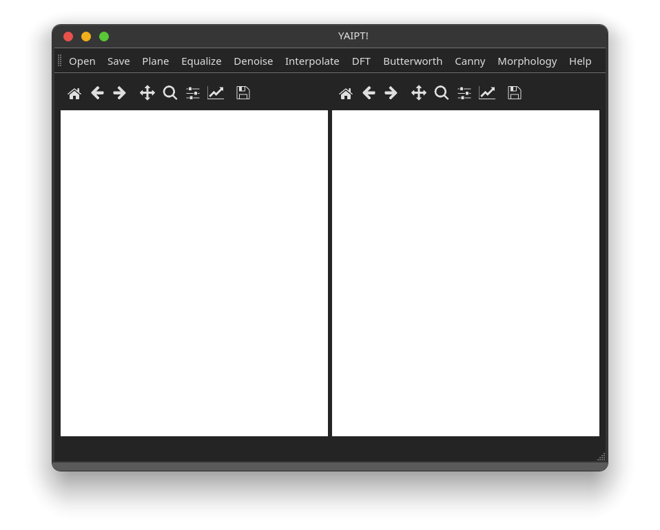
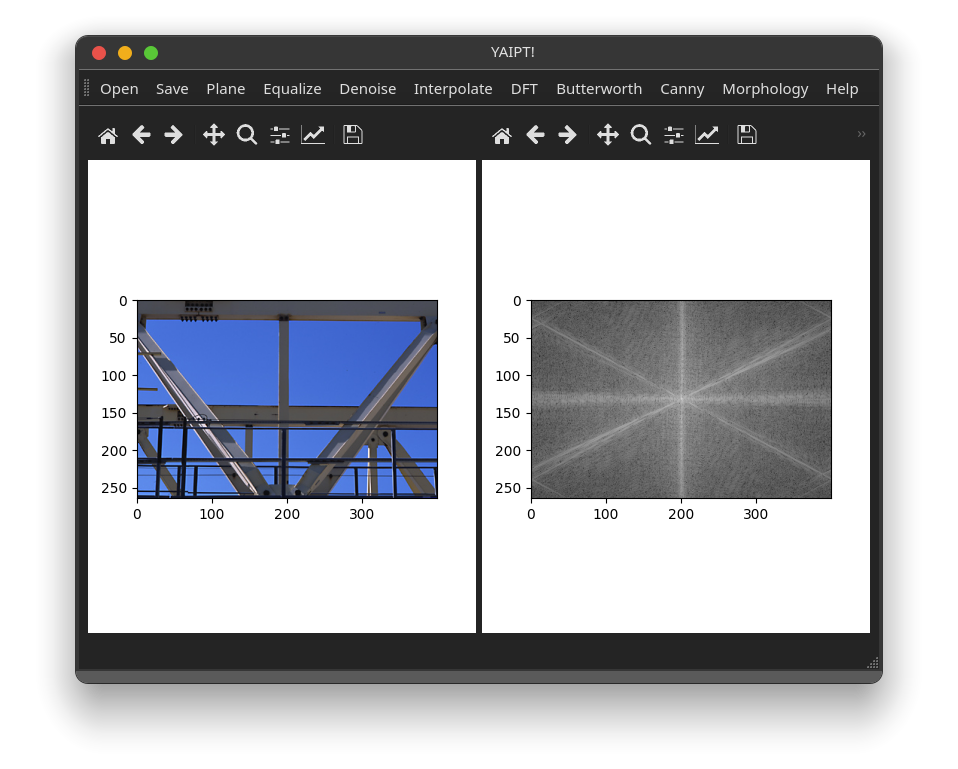
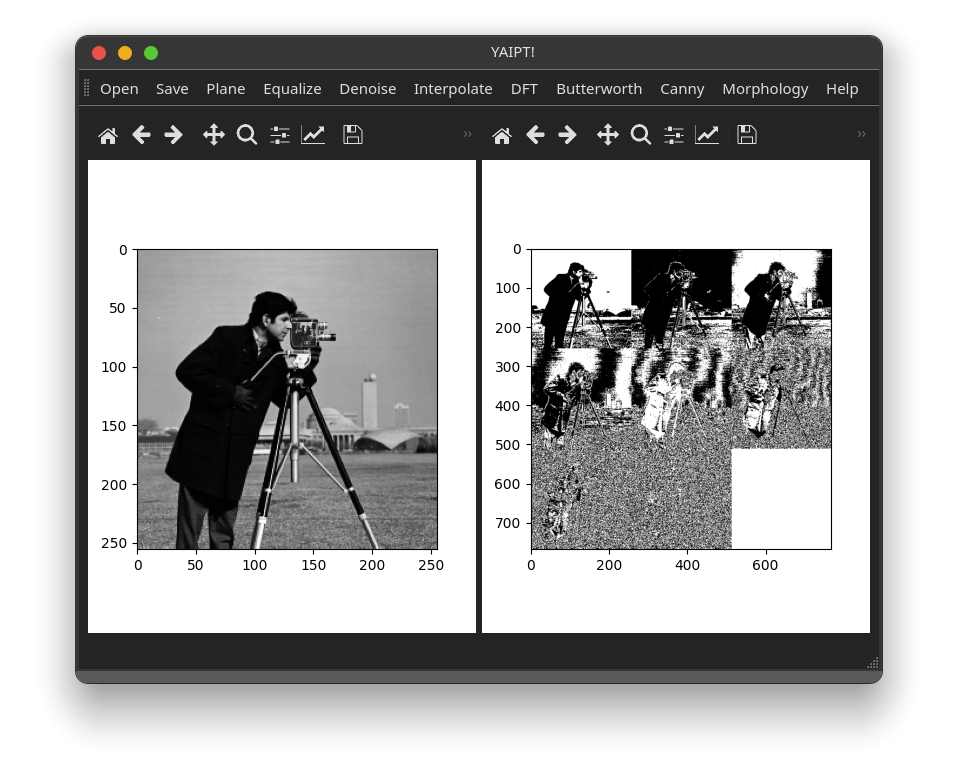
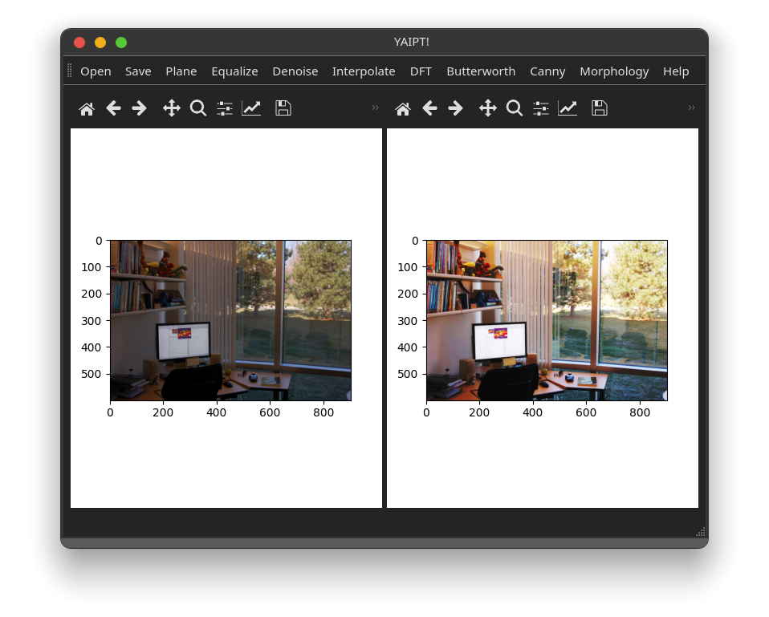
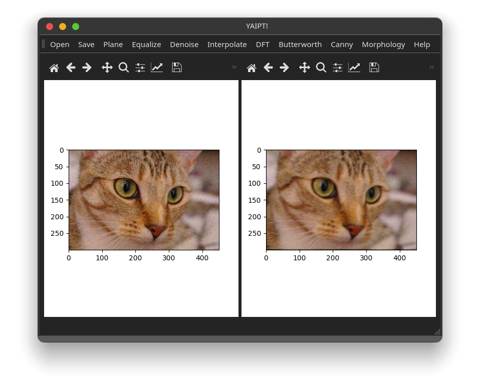
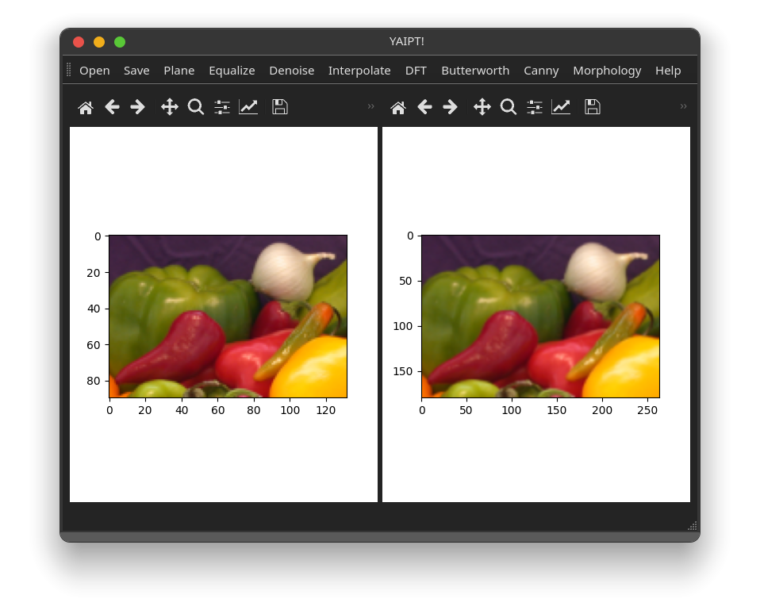
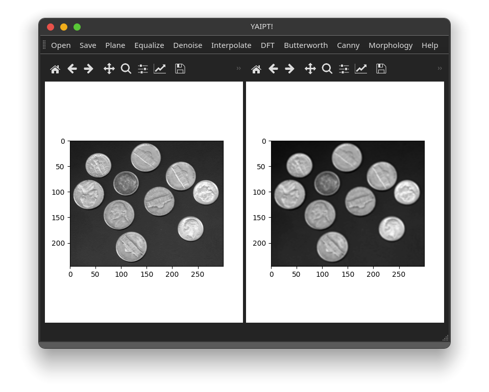
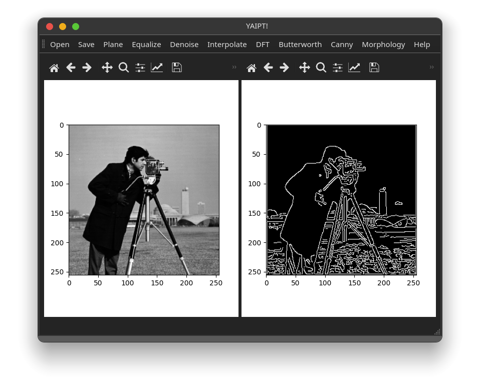
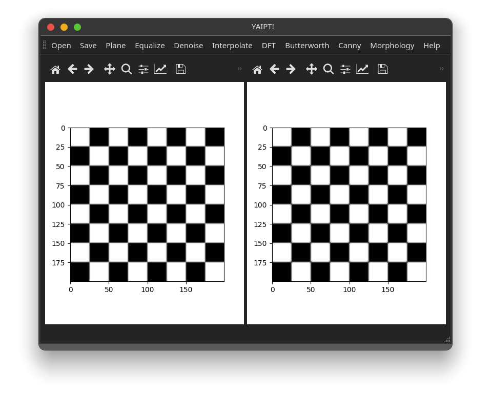

#  Yet Another Image Processing Tool

## 简介

本项目是南京大学2021年数字图像处理课程大实验，旨在鼓励同学亲自动手，实现算法，增强理解。

## 标准

截止时间**2021年圣诞节12月25日23:59:59**。

每个需要实现的算法各**100**分（除了Canny算法**150**分），总分达到**550**分本课程实验满分，所有同学都**不**需要撰写实验报告，评分主要考察实现**效果**和**代码**。

同学们唯一需要使用的第三方库是[NumPy](https://numpy.org)（例如`np.fft`可以直接用），如果代码使用其他第三方库，该算法实现得分最多**30**分。如果按照下文自行扩展**非平凡**功能，该算法实现分值为**150**分（仅限一次有效）。

如果发现抄袭其他同学代码，**倒扣**相关同学在相关算法上的得分。

## 使用

推荐使用[PyCharm](https://www.jetbrains.com/pycharm)打开本项目，打开`requirements.txt`自动安装依赖，或者通过命令`pip install -r requirements.txt`安装。 运行`main.py`，出现如下界面启动成功。

通过`Open`打开图片，在左侧显示，任意选择一个算法，点击之后结果在右侧显示，再用`Save`保存图片。


## 任务

实验中只会用到灰度图（形状`[H,W]`）和RGB图（形状`[H,W,3]`），可以通过`if img.ndim == 2:`是灰度图还是RGB图。对于只接受二维图像的算法，已经预先将RGB图转为灰度图。除了位平面使用8比特表示，其余均用0到1浮点表示。

|  算法  | 图片类型 | 数据表示  |
| :----: | :------: | :-------: |
| 位平面 |  灰度图  | 8比特整型 |
| 直方图均衡 | 均可 | 0到1浮点 |
| 去噪 | 均可 | 0到1浮点 |
| 插值 | 均可 | 0到1浮点 |
| 傅里叶变换 | 灰度图 | 0到1浮点 |
| 巴特沃斯低通滤波 | 灰度图 | 0到1浮点 |
| 坎尼边缘检测 | 灰度图 | 0到1浮点 |
| 形态学开操作 | 灰度图 | 0到1浮点 |


同学们的任务是按照下面要求完善`algorithm.py`，一般不用改动其他代码文件（除非想要扩展功能）。

### 位平面

输出`[3*H,3*W]`的九宫格，依次是从高到低比特单独表示的结果。


### 直方图均衡

将灰度直方图变换成尽可能平（均匀分布），如果是RGB图对三通道分别处理。


### 去噪

任意实现一个去噪算法（例如中值滤波器），因为算法不尽相同，效果也不一样，评价只考察代码。


### 插值

将输入图片大小变为两倍，使用任意插值算法均可（不必局限课程），注意示例中的横纵轴变化。


### 傅里叶变换

需要注意频率域原点移到图像中心，为了美观结果记得取对数，调用`np.fft`可以快速完成。


### 巴特沃斯低通滤波

必讲的频率域低通滤波，可以在上一题基础上添加代码，截止频率自行设置。


### 坎尼边缘检测

非常经典的边缘检测算法，考虑到难度高于其他算法，分值设为**150**分。


### 形态学开操作

结构元采用3*3实现比较容易，注意示例中的交点变化。


## 扩展

如果想要扩展功能添加算法`ABC`，熟悉PyQt的同学不作赘述，不熟悉的同学也有办法。
首先编辑`ui_mainwindow.py`，仿照已有代码，加入如下代码。
```python
...
self.actionABC = QtWidgets.QAction(MainWindow)
self.actionABC.setText("ABC")
self.actionABC.setObjectName("actionABC")
...
self.toolbar.addAction(self.actionABC)
...
```
然后编辑`mainwindow.py`，在函数`connect`中添加。
```python
self.ui.actionABC.triggered.connect(self.handleABC)
```
继续添加`handleABC`方法，一般会用到装饰器`draw(2)`，可以将它理解为，自动在函数调用前处理异常，并在函数调用后显示图像。
```python
@draw(2)
def handleABC(self):
    self.img2 = abc(self.img1)
```
最后修改`algorithm.py`，实现扩展算法。
```python
def abc(img: ndarray) -> ndarray:
    # Your Code
```

## 致谢

本项目使用了[Matlab](https://www.mathworks.com/products/matlab.html)和[scikit-image](https://scikit-image.org)的图像用例，以及[icons8](https://icons8.com)的程序图标，在此致谢。
